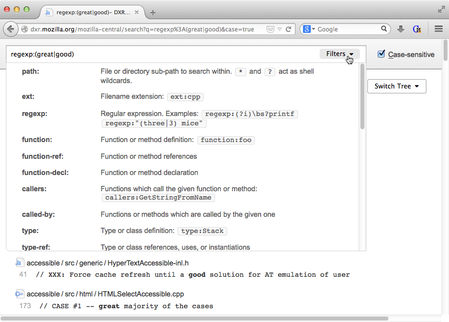

===
DXR
===

DXR is a code search and navigation tool aimed at making sense of large
projects like Firefox. It supports full-text and regex searches as well as
structural queries like "Find all the callers of this function." Behind the
scenes, it uses trigram indices, elasticsearch, and static analysis data
collected by instrumented compilers to make searches faster and more accurate
than is possible with simple tools like grep. DXR also exposes a plugin API
through which understanding of more languages can be added.

* Example: http://dxr.mozilla.org/
* Documentation: https://dxr.readthedocs.org/
