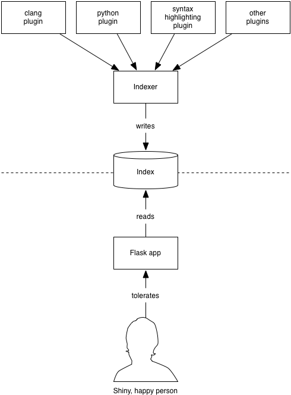

===========
Development
===========


Architecture
------------



DXR divides into 2 halves, with stored indices in the middle:

1. The indexer, run via :program:`dxr index`, is a batch job which analyzes
   code and builds indices in elasticsearch, one per tree, plus a
   :term:`catalog index` that keeps track of them. The indexer hosts various
   plugins which handle everything from syntax coloring to static analysis.

   Generally, the indexer is kicked off asynchronously—often even on a separate
   machine—by cron or a build system. It's up to deployers to come up with
   strategies that make sense for them.

2. The second half is a Flask web application which lets users run queries.
   :program:`dxr serve` runs a toy instance of the application for development
   purposes; a more robust method should be used for :doc:`deployment`.


How Indexing Works
==================

We store every line of source code as an elasticsearch document of type
``line`` (hereafter called a "LINE doc" after the name of the constant used in
the code). This lends itself to the per-line search results DXR delivers. In
addition to the text of the line, indexed into trigrams for fast substring and
regex search, a LINE doc contains some structural data.

* First are :term:`needles<needle>`, search targets that structural queries
  can hunt for. For example, if we indexed the following Python source code,
  the indicated (simplified) needles might be attached:

  .. code-block:: python

     def frob():     # py-function: frob
         nic(ate())  # py-callers:  [nic, ate]

  If the user runs the query ``function:frob``, we look for LINE docs with
  "frob" in their "py-function" properties. If the user runs the query
  ``callers:nic``, we look for docs with "py-callers" properties containing
  "nic".

  These needles are offered up by plugins via the
  :meth:`~dxr.indexers.FileToIndex.needles_by_line()` API. For the sake of
  sanity, we've settled on the convention of a language prefix for
  language-specific needles. However, the names are technically arbitrary,
  since the plugin emitting the needle is also its consumer, through the
  implementation of a :class:`~dxr.filters.Filter`.
* Also attached to a LINE doc are offsets/metadata pairs that attach CSS
  classes and contextual menus to various spans of the line. These also come
  out of plugins, via :meth:`~dxr.indexers.FileToSkim.refs()` and
  :meth:`~dxr.indexers.FileToSkim.regions()`. Views of entire source-code files
  are rendered by stitching multiple LINE docs together.

The other major kind of entity is the FILE doc. These support directory
listings and the storage of per-file rendering data like navigation-pane
entries (given by :meth:`~dxr.indexers.FileToSkim.links()`) or image contents.
FILE docs may also contain needles, supporting searches like ``ext:cpp`` which
return entire files rather than lines. Plugins provide these needles via
:meth:`~dxr.indexers.FileToIndex.needles()`.


Setting Up
----------

Here is the fastest way to get hacking on DXR.

.. include:: download-boot-and-build.rst

Running A Test Index
====================

The folder-based test cases make decent workspaces for development, suitable
for manually trying out your changes. ``test_basic`` is a good one to start
with. To get it running... ::

    cd ~/dxr/tests/test_basic
    dxr index
    dxr serve -a

You can then surf to http://33.33.33.77:8000/ from the host machine and play
around. When you're done, stop the server with :kbd:`Control-C`.


Workflow
--------

The repository on your host machine is mirrored over to the VM via Vagrant's
shared-folder magic. Changes you make outside the VM will be instantly
available within and vice versa, so you can edit using your usual tools on the
host and still use the VM to run DXR.

After making changes to DXR, a build step is sometimes needed to see the
effects of your work:

Changes to C++ or other code with an explicit compilation phase:
    ``make`` (at the root of the project)

Changes to HTML templates that are used on the client side:
    ``make templates``. (This is a subset of ``make``, above, and may be
    faster.) Alternatively, leave ``node_modules/.bin/grunt watch`` running,
    and it will take care of recompiling the templates as necessary.

Changes to the format of the elasticsearch index:
    Re-run ``dxr index`` inside your test folder (e.g.,
    :file:`tests/test_basic`). Before committing, you should increment the
    :term:`format version`.

Stop :program:`dxr serve`, run any applicable build steps, and then fire up
the server again. If you're changing Python code that runs only at request
time, you shouldn't need to do anything; :program:`dxr serve` will notice
and restart itself a few seconds after you save.


Coding Conventions
------------------

Follow `PEP 8`_ for Python code, but don't sweat the line length too much.
Follow `PEP 257`_ for docstrings, and use Sphinx-style argument documentation.
Single quotes are preferred for strings; use 3 double quotes for docstrings and
multiline strings or if the string contains a single quote.

.. _PEP 8: http://www.python.org/dev/peps/pep-0008/
.. _PEP 257: http://www.python.org/dev/peps/pep-0257/


Testing
-------

DXR has a fairly mature automated testing framework, and all server-side
patches should come with tests. (Tests for client-side contributions are
welcome as well, but we haven't got the harness set up yet.)


Writing Tests for DXR
=====================

DXR supports two kinds of integration tests:

1. A lightweight sort with a single file worth of analyzed code. This kind
   stores the code as a Python string within a subclass of
   ``SingleFileTestCase``. At test time, it instantiates the file on
   disk in a temp folder, builds it, and makes assertions about it. If
   the ``should_delete_instance`` class variable is truthy (the default), it
   then deletes the instance. If you want to examine the instance manually for
   troubleshooting, set this to ``False``.

2. A heavier sort of test: a folder containing one or more source trees and a
   DXR config file. These are useful for tests that require a multi-file tree
   to analyze or more than one tree. ``test_ignores`` is an example. Within
   these folders are also one or more Python files containing subclasses of
   ``DxrInstanceTestCase`` which express the actual tests. These trees can be
   built like any other using ``dxr index``, in case you want to do manual
   exploration.

Running the Tests
=================

To run all the tests, run this from the root of the DXR repository::

    make test

To run just the tests in ``tests/test_functions.py``... ::

    nosetests tests/test_functions.py

To run just the tests from a single class... ::

    nosetests tests/test_functions.py:ReferenceTests

To run a single test... ::

    nosetests tests/test_functions.py:ReferenceTests.test_functions

If you have trouble, make sure you didn't mistranscribe any colons or
periods.

To omit the often distracting elasticsearch logs that nose typically presents
when a test fails, add the ``--nologcapture``, flag.


.. _writing-plugins:

Writing Plugins
---------------

Plugins are the way to add new types of analysis, indexing, searching, or
display to DXR. In fact, even DXR's basic capabilities, such as text search
and syntax coloring, are implemented as plugins. Want to add support for a new
language? A new kind of search to an existing language? A new kind of
contextual menu cross-reference? You're in the right place.

At the top level, a :class:`~dxr.plugins.Plugin` class binds together a
collection of subcomponents which do the actual work:

.. digraph:: plugin

   "Plugin" -> "TreeToIndex" -> "FileToIndex";
   "Plugin" -> "FileToSkim";
   "Plugin" -> "filters";
   "Plugin" -> "mappings";
   "Plugin" -> "analyzers";

Registration
============

A Plugin class is registered via a `setuptools entry point
<https://pythonhosted.org/setuptools/setuptools.html#dynamic-discovery-of-
services-and-plugins>`__ called ``dxr.plugins``. For example, here are the
registrations for the built-in plugins, from DXR's own :file:`setup.py`::

    entry_points={'dxr.plugins': ['urllink = dxr.plugins.urllink',
                                  'buglink = dxr.plugins.buglink',
                                  'clang = dxr.plugins.clang',
                                  'omniglot = dxr.plugins.omniglot',
                                  'pygmentize = dxr.plugins.pygmentize']},

The keys in the key/value pairs, like "urllink" and "buglink", are the strings
the deployer can use in the ``enabled_plugins`` config directive to turn them
on or off. The values, like "dxr.plugins.urllink", can point to either...

1. A :class:`~dxr.plugins.Plugin` class which itself points to filters,
   skimmers, indexers, and such. This is the explicit approach—more lines of
   code, more opportunities to buck convention—and thus not recommended in
   most cases. The :class:`~dxr.plugins.Plugin` class itself is just a dumb
   bag of attributes whose only purpose is to bind together a collection of
   subcomponents that should be used together.

2. Alternatively, an entry point value can point to a module which contains
   the subcomponents of the plugin, each conforming to a naming convention by
   which it can be automatically found. This method saves boilerplate and
   should be used unless there is a compelling need otherwise. Behind the
   scenes, an actual Plugin object is constructed implicitly: see
   :meth:`~dxr.plugins.Plugin.from_namespace` for details of the naming
   convention.

Here is the Plugin object's API, in case you do decide to construct one
manually:

    .. autoclass:: dxr.plugins.Plugin
       :members:

Actual plugin functionality is implemented within tree indexers, file
indexers, filters, and skimmers.

Tree Indexers
=============

.. autoclass:: dxr.indexers.TreeToIndex
   :members:

File Indexers
=============

.. autoclass:: dxr.indexers.FileToIndex
   :members:

FileToIndex also has all the methods of its superclass,
:class:`~dxr.indexers.FileToSkim`.

Looking Inside Elasticsearch
````````````````````````````

While debugging a file indexer, it can help to see what is actually getting
into elasticsearch. For example, if you are debugging
:meth:`~dxr.indexers.FileToIndex.needles_by_line`, you can see all the data
attached to each line of code (up to 1000) with this curl command::

    curl -s -XGET "http://localhost:9200/dxr_10_code/line/_search?pretty&size=1000"

Be sure to replace "dxr_10_code" with the name of your DXR index. You
can see which indexes exist by running... ::

    curl -s -XGET "http://localhost:9200/_status?pretty"

Similarly, when debugging :meth:`~dxr.indexers.FileToIndex.needles`, you can
see all the data attached to files-as-a-whole with... ::

    curl -s -XGET "http://localhost:9200/dxr_10_code/file/_search?pretty&size=1000"

File Skimmers
=============

.. note::

    The code that will call skimmers isn't in place yet.

.. autoclass:: dxr.indexers.FileToSkim
   :members:

Filters
=======

.. autoclass:: dxr.filters.Filter
   :members:

Mappings
========

When you're laying down data to search upon, it's generally not enough just to
write :meth:`~dxr.indexers.FileToIndex.needles` or
:meth:`~dxr.indexers.FileToIndex.needles_by_line` implementations. If you want
to search case-insensitively, for example, you'll need elasticsearch to fold
your data to lowercase. (Don't fall into the trap of doing this in Python; the
Lucene machinery behind ES is better at the complexities of Unicode.) The way
you express these instructions to ES is through mappings and analyzers.

ES :term:`mappings<mapping>` are schemas which specify type of data (string,
int, datetime, etc.) and how to index it. For example, here is an excerpt of
DXR's core mapping, defined in the ``core`` plugin::

    mappings = {
        # Following the typical ES mapping format, `mappings` is a hash keyed
        # by doctype. So far, the choices are ``LINE`` and ``FILE``. 
        LINE: {
            'properties': {
                # Line number gets mapped as an integer. Default indexing is fine
                # for numbers, so we don't say anything explicitly.
                'number': {
                    'type': 'integer'
                },

                # The content of the line itself gets mapped 3 different ways.
                'content': {
                    # First, we store it as a string without actually putting it
                    # into any ordered index structure. This is for retrieval and
                    # display in search results, not for searching on:
                    'type': 'string',
                    'index': 'no',

                    # Then, we index it in two different ways: broken into
                    # trigrams (3-letter chunks) and either folded to lowercase or
                    # not. This cleverness takes care of substring matching and
                    # accelerates our regular expression search:
                    'fields': {
                        'trigrams_lower': {
                            'type': 'string',
                            'analyzer': 'trigramalyzer_lower'
                        },
                        'trigrams': {
                            'type': 'string',
                            'analyzer': 'trigramalyzer'
                        }
                    }
                }
            }
        },
        FILE: ...
    }

Mappings follow exactly the same structure as required by `ES's "put mapping"
API
<http://www.elastic.co/guide/en/elasticsearch/reference/current/indices-put-mapping.html>`__. The `choice of mapping types
<http://www.elastic.co/guide/en/elasticsearch/reference/current/mapping-types.html>`__ is also outlined in the ES documentation.

.. warning::

    Since a FILE-domain query will be promoted to a LINE query if any other
    query term triggers a line-based query, it's important to keep field names
    and semantics the same between lines and files. In other words, a LINE
    mapping should generally be a superset of a FILE mapping. Otherwise, ES
    will guess mappings for the undeclared fields, and surprising search
    results will likely ensue. Worse, the bad guesses will likely happen
    intermittently.

The Format Version
``````````````````

In the top level of the :file:`dxr` package (not the top of the source
checkout, mind you) lurks a file called
:file:`format`. Its role is to facilitate the automatic deployment of new
versions of DXR using :program:`dxr deploy`. The format file contains an
integer which represents the index format expected by
:program:`dxr serve`. If a change in the code requires a mapping or semantics
change in the index, the format version must be incremented. In response, the
deployment script will wait until new indices, of the new format, have been
built before deploying the change.

If you aren't sure whether to bump the format version, you can always build an
index using the old code, then check out the new code and try to serve the
old index with it. If it works, you're probably safe not bumping the version.

Analyzers
=========

In Mappings, we alluded to custom indexing strategies, like breaking strings
into lowercase trigrams. These strategies are called
:term:`analyzers<analyzer>` and are the final component of a plugin. ES has
`strong documentation on defining analyzers
<http://www.elastic.co/guide/en/elasticsearch/reference/current/analysis.html>`__.
Declare your analyzers (and building blocks of them, like tokenizers) in
the same format the ES documentation prescribes. For example, the analyzers
used above are defined in the core plugin as follows::

    analyzers = {
        'analyzer': {
            # A lowercase trigram analyzer:
            'trigramalyzer_lower': {
                'filter': ['lowercase'],
                'tokenizer': 'trigram_tokenizer'
            },
            # And one for case-sensitive things:
            'trigramalyzer': {
                'tokenizer': 'trigram_tokenizer'
            }
        },
        'tokenizer': {
            'trigram_tokenizer': {
                'type': 'nGram',
                'min_gram': 3,
                'max_gram': 3
                # Keeps all kinds of chars by default.
            }
        }
    }

Crash Early, Crash Often
========================

Since :program:`dxr index` generally runs without manual supervision, it's
better to err on the side of crashing than to risk incorrectness. Any error
that could make a plugin emit inaccurate output should be fatal. This keeps
DXR's structural queries trustworthy.


Contributing Documentation
--------------------------

We use `Read the Docs`_ for building and hosting the documentation, which uses
`sphinx`_ to generate HTML documentation from reStructuredText markup.

To edit documentation:

  * Edit :file:`*.rst` files in :file:`docs/source/` in your local checkout.
    See `reStructuredText primer`_ for help with syntax.
  * Use ``cd ~/dxr/docs && make html`` in the VM to preview the docs.
  * When you're satisfied, submit the pull request as usual.

.. _Read the Docs: https://docs.readthedocs.org/
.. _sphinx: http://sphinx-doc.org/
.. _reStructuredText primer: http://sphinx-doc.org/rest.html

Troubleshooting
---------------

Why is my copy of DXR acting erratic, failing at searches, making requests for JS templates that shouldn't exist, and just generally not appearing to be in sync with my changes?
    Did you run ``python setup.py install`` for DXR at some point? Never, ever
    do that in development; use ``python setup.py develop`` instead. Otherwise,
    you will end up with various files copied into your virtualenv, and your
    edits to the originals will have no effect.

How can I use pdb to debug indexing?
    In the DXR config file for the tree you're building, add ``workers = 0``
    to the ``[DXR]`` section. That will keep DXR from spawning multiple worker
    processes, something pdb doesn't tolerate well.

I pulled a new version of the code that's supposed to have a new plugin (or I added one myself), but it's acting like it doesn't exist.
    Re-run ``python setup.py develop`` to register the new setuptools entry point.
