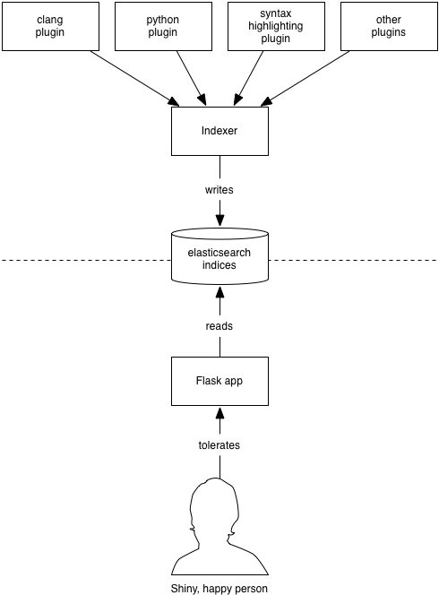

===========
Development
===========

Architecture
------------

DXR divides into 2 halves:

1. The :term:`indexer`, :program:`dxr-serve.py`, is a batch job which analyzes
   code and builds on-disk indices.

   The indexer hosts various plugins which handle everything from syntax
   coloring to static analysis. The clang plugin, for example, which handles
   structural analysis of C++ code, builds the project under clang while
   interposing a custom compiler plugin. The plugin rides sidecar with the
   compiler, dumping out structural data into CSV files, which the DXR plugin
   later pulls in and uses to generate the SQLite tables that support
   structural queries like ``callers:`` and ``function:``.

   Generally, the indexer is kicked off asynchronously—often even on a separate
   machine—by cron or a build system. It's up to deployers to come up with
   strategies that make sense for them.

2. A Flask web application which lets users query those indices. The development
   entrypoint for the web application is :program:`dxr-serve.py`, but a more
   robust method should be used for :doc:`deployment`.

Setting Up
----------

Here we show the fastest way to get hacking on DXR.

.. include:: download-boot-and-build.rst

Running A Test Index
====================

The folder-based test cases make decent workspaces for development, suitable
for manually trying out your changes. ``test_basic`` is a good one to start
with. To get it running... ::

    cd ~/dxr/tests/test_basic
    make
    dxr-serve.py -a target

You can then surf to http://33.33.33.77:8000/ from the host machine and play
around. When you're done, stop the server with :kbd:`Control-C`.

Workflow
--------

The repository on your host machine is mirrored over to the VM via Vagrant's
shared-folder magic. Changes you make outside the VM will be instantly
available within and vice versa, so you can edit using your usual tools on the
host and still use the VM to run DXR.

After making changes to DXR, a build step is sometimes needed to see the
effects of your work:

Changes to C-based compiler plugins or TriLite:
    ``make`` (at the root of the project)

Changes to HTML templates that are used on the client side:
    ``make templates``. (This is a subset of ``make``, above, and may be
    faster.) Alternatively, leave ``node_modules/.bin/grunt watch`` running,
    and it will take care of recompiling the templates as necessary.

Changes to server-side HTML templates or the DB schema:
    Run ``make`` inside :file:`tests/test_basic`.

Stop :program:`dxr-serve.py`, run the build step, and then fire up the server
again. If you're changing Python code that runs only at request time, the
server should notice and restart itself a few seconds after you save.

Testing
-------

DXR has a fairly mature automated testing framework, and all server-side
patches should come with tests. (Tests for client-side contributions are
welcome as well, but we haven't got the harness set up yet.)

Writing Tests for DXR
=====================

DXR supports two kinds of tests:

1. A lightweight sort with a single file worth of C++ code. This kind
   stores the C++ source as a Python string within a subclass of
   ``SingleFileTestCase``. At test time, it creates a DXR instance on
   disk in a temp folder, builds it, and makes assertions about it. If
   the ``should_delete_instance`` class variable is truthy, it then
   deletes the instance. If you want to examine the instance manually
   for troubleshooting, set this to ``False``.

2. A heavier sort of test which consists of a full DXR instance on disk.
   ``test_ignores`` is an example. Within these instances are one or
   more Python files containing subclasses of ``DxrInstanceTestCase``
   which express the actual tests. These instances can be built like any
   other using ``dxr-build.py``, in case you want to do manual
   exploration.

Running the Tests
=================

To run all the tests, run this from the root of the DXR repository::

    make test

To run just the tests in ``tests/test_functions.py``... ::

    nosetests tests/test_functions.py

To run just the tests from a single class... ::

    nosetests tests/test_functions.py:ReferenceTests

To run a single test... ::

    nosetests tests/test_functions.py:ReferenceTests.test_functions

If you have trouble, make sure you didn't mistranscribe any colons or
periods. Also, if you did not install :file:`libtrilite.so` globally, you'll
need to make sure ``$LD_LIBRARY_PATH`` in your environment points to the
:file:`trilite` folder.

The Format Version
------------------

At the root level of the repo lurks a file called :file:`format`. Its role is
to facilitate the automatic deployment of new versions of DXR using a script
like the included :file:`deploy.py`. The format file contains an integer which
represents the instance format expected by the DXR code. If a change in the
code requires something new in the instance, generally (1) differently
structured HTML or (2) a new DB schema, the format version must be incremented
with the code change. In response, the deployment script will wait until a new
instance, of the new format, has been built before deploying the change.

If you aren't sure whether to bump the format version, you can always build an
instance using the old code, then check out the new code and try to serve the
old instance with it. If it works, you're probably safe not bumping the format.

Coding Conventions
------------------

Follow `PEP 8`_ for Python code, but don't sweat the line length too much.

.. _PEP 8: http://www.python.org/dev/peps/pep-0008/

Writing Plugins
---------------

See :doc:`plugins`.

FAQ
---

Why is my copy of DXR acting erratic, failing at searches, making requests for JS templates that shouldn't exist, and just generally not appearing to be in sync with my changes?
    Have you run ``python setup.py install`` for DXR at some point? Never, ever
    do that in development; use ``python setup.py develop`` instead. Otherwise,
    you will end up with various files copied into your virtualenv, and your edits to the originals will have no effect.
